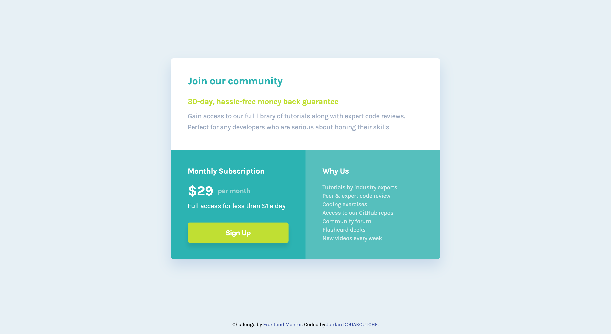

# Frontend Mentor - Single price grid component solution

This is a solution to the [Single price grid component challenge on Frontend Mentor](https://www.frontendmentor.io/challenges/single-price-grid-component-5ce41129d0ff452fec5abbbc). Frontend Mentor challenges help you improve your coding skills by building realistic projects.

## Table of contents

- [Overview](#overview)
  - [The challenge](#the-challenge)
  - [Screenshot](#screenshot)
  - [Links](#links)
- [My process](#my-process)
  - [Built with](#built-with)
  - [Useful resources](#useful-resources)
- [Author](#author)
- [Acknowledgments](#acknowledgments)

## Overview

### The challenge

Users should be able to:

- View the optimal layout for the component depending on their device's screen size
- See a hover state on desktop for the Sign Up call-to-action

### Screenshot

Mobile

Desktop

### Links

- Solution URL: [https://github.com/douako-j/Single-price-grid-component](https://github.com/douako-j/Single-price-grid-component)
- Live Site URL: [https://douako-j.github.io/Single-price-grid-component/](https://douako-j.github.io/Single-price-grid-component/)

## My process

### Built with

- Semantic HTML5 markup
- CSS custom properties
- Flexbox
- CSS Grid
- Mobile-first workflow

### Useful resources

- [Dyma courses](https://dyma.fr/) - This courses helped me Learn HTML CSS SASS and GIT.

## Author

- Website [nkoyin.fr](http://www.nkoyin.fr/)
- GitHub [@douako-j](https://github.com/douako-j)
- Instagram [@nkoyinn](https://www.instagram.com/nkoyinn/)
- Frontend Mentor - [@douako-j](https://www.frontendmentor.io/profile/douako-j)

## Acknowledgments

- [Steps to replicate a design with only HTML and CSS](https://devchallenges-blogs.web.app/how-to-replicate-design/)
